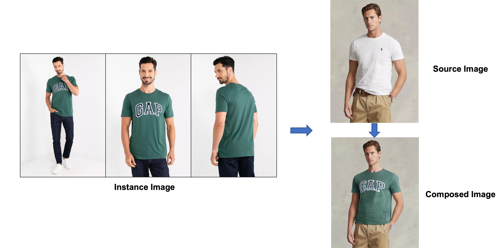

# Image Composition via Stable Diffusion 

### We achieve image composition via Stable Diffusion Model. Application includes Virtual Clothes / Funiture Try-on.

<!--  -->
<p align = "center">
    
</p>
<p align = "center">
    Demo 1: Virtual Clothes Try-on
</p>

---
<!--  -->
<p align = "center">
    
</p>
<p align = "center">
    Demo 2: Virtual Furniture Try-on
</p>

### Installation
* Requirements
  ```bash
conda install pytorch==1.12.1 torchvision==0.13.1 torchaudio==0.12.1 cudatoolkit=11.3 -c pytorch 
pip install -r requirements.txt
```

* Initialize an [🤗Accelerate](https://github.com/huggingface/accelerate/) environment with
  ```bash
  accelerate config default
  ```

* Run the following command to authenticate your token

  ```bash
  huggingface-cli login
  ```

### 0. Prepare Images
Please provide at least one images in .jpg format and instance prompt.
For example, images in ./data/sofa

### 1. Set Environment
```bash
export MODEL_NAME="runwayml/stable-diffusion-inpainting"
export INSTANCE_DIR="data/sofa"
export Test_DIR="data/sofa_test"
export MODEL_DIR="logs/sofa"
export OUT_DIR="out/sofa"
export INSTANCE_PROMPT="sofa"
```

### 2. Preprocess Images
Please provide at least one images in .jpg format and instance prompt. The preprocess.py script will generate captions and instance masks.

```bash
python preprocess.py --instance_data_dir $INSTANCE_DIR \
                     --instance_prompt $INSTANCE_PROMPT
```

### 3. Finetune Stable Diffusion Inpainting
We then finetune Stable Diffusion Inpainting to embed the instance images and prompt into stable diffusion model.

```bash
accelerate launch --num_processes 1 train.py \
  --pretrained_model_name_or_path=$MODEL_NAME  \
  --instance_data_dir=$INSTANCE_DIR \
  --output_dir=$MODEL_DIR \
  --instance_prompt=$INSTANCE_PROMPT \
  --resolution=512 \
  --train_batch_size=1 \
  --gradient_accumulation_steps=1 \
  --learning_rate=5e-6 \
  --lr_scheduler="constant" \
  --lr_warmup_steps=0 \
  --max_train_steps=1000
```

### 4. Image Composition
Finally, you can provide new images to achieve image composition.

```bash
python inference.py --image_path $Test_DIR \
                    --model_path $MODEL_DIR \
                    --out_path $OUT_DIR \
                    --instance_prompt $INSTANCE_PROMPT
```

### Or else
using end-to-end run_sd.sh.

```bash
bash run.sh
```

### GPU Memory
We tested the code on RTX3090 GPU. If there is Out-of-Memory error, please refer to for low memory training: 

* [dreambooth](https://github.com/huggingface/diffusers/tree/main/examples/dreambooth)

### Authors:
* [Tao Hu](https://tau-yihouxiang.github.io)
* [RealityEditor](https://realityeditor.com.cn)
